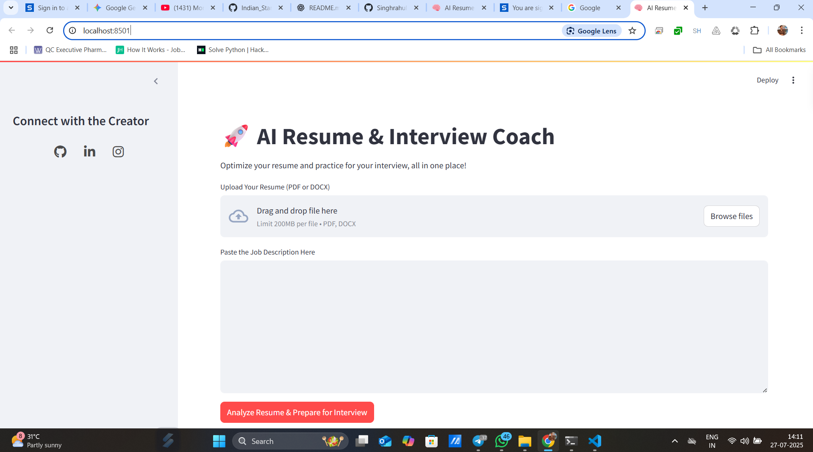
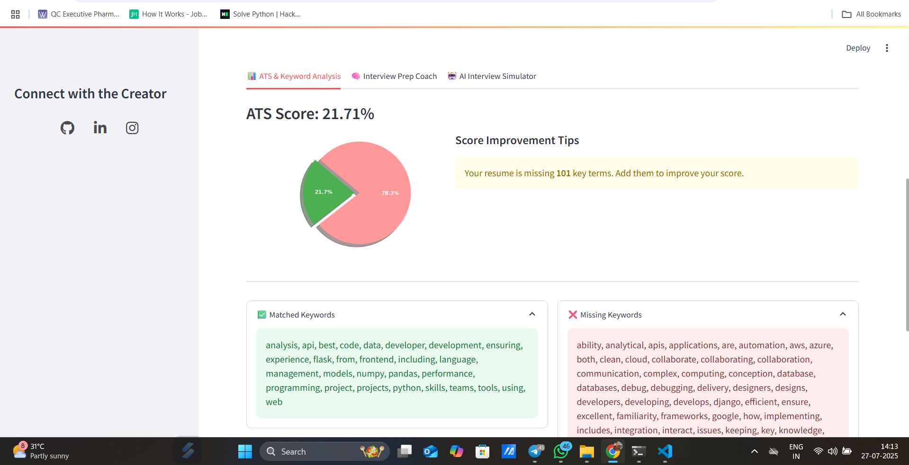
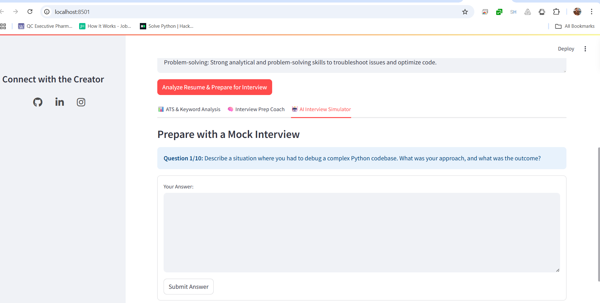

# 🚀 AI Resume & Interview Coach

<p align="center">
  
  
  
</p>

<p align="center">
  <b>Smart AI Tool to Optimize Resumes & Crack Interviews</b>
</p>

---

## 🌟 Overview

**AI Resume & Interview Coach** is a powerful AI-driven web application that helps users:

- Optimize resumes for ATS systems  
- Prepare for interviews with AI-generated questions  
- Simulate real-world interviews  
- Get performance feedback  

👉 Built for **students, job seekers, and developers** aiming to improve their chances in the hiring process.

---

## ⚡ Key Features

### 🔍 ATS Resume Analyzer
- Get ATS score instantly  
- Identify missing keywords  
- Visual insights for improvement  

### ✍️ Resume Optimization
- Auto-add missing keywords  
- Improve job matching score  

### 🧠 AI Interview Coach
- Personalized questions  
- Behavioral + technical prep  

### 🤖 Mock Interview Simulator
- Real-time AI interaction  
- Job-role-based simulation  

### 📊 Performance Feedback
- Detailed evaluation  
- Strengths & improvement areas  

---

## 🖥️ Demo Preview

<p align="center">
  
</p>

<p align="center">
  
</p>

<p align="center">
  
</p>

---

## 🚀 Live Demo

🔗 **Try it now:**  
https://livesoon......./

---
---

## 🧠 Architecture

<p align="center">
  
</p>

---

## 🏗️ Project Structure

```bash
📦 ai-resume-interview-coach/
├── app.py
├── requirements.txt
├── render.yaml
├── resume/
│   ├── analyzer.py
│   ├── editor.py
│   └── extractor.py
├── interview/
│   ├── coach.py
│   └── simulator.py
└── utils/
    └── visualizer.py
